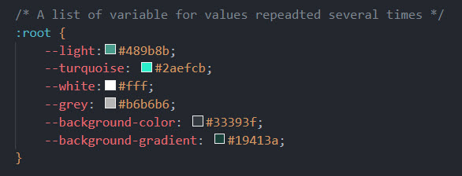

# CSS Cheat Sheet

## Description 📝

For our lesson activity, I was required to re-create a cheat sheet design using various CSS properties we had used previously. Creating mini cards for code snippets for users to be able to select and copy into their code. 

## Learning Points 💡

- I used CSS variables within this project for repeated property values such as colours. 
- This was the first time we had used the `<pre>` tag in our HTML and doing so made the text in the code snippet appear as it should with the correct indentations etc. 
- I used transition effects for when the 'cards' load on the page to and also used the `:hover` selector to add an effect when the user hovers over the card.
- Again we used `@media` queries to help with the resizing of the content for smaller screens. 

In all it was quite a tough project for our first week, recalling previous CSS properties we had learnt and using them to create something from scratch was pretty rewarding. Although I did not complete it during the 45 minutes we were given in class, I was able to continue working on it in the evening after class and added the finishing touches the following morning.

## Useful Information 🚩

The page is deployed on GitHub - [click here](https://rbrd87.github.io/mini-project-css-cheat-sheet/)

The repository of the project is also hosted on GitHub - [click here](https://github.com/rbrd87/mini-project-css-cheat-sheet)

## Screenshots 📸

Here is what the finished website looks like

Here you can also see the responsiveness of site due to the media queries used

  
See tablet

  
  

  
See mobile

  
  

 

As mentioned above it was the first time I had used CSS Variables within my code and it made it look a lot neater and tidier, which I was pretty happy about 😄

And finally here are some little code snippets of my HTML and CSS to see how I went about creating the little cards for each code snippet.

#### HTML

#### CSS
